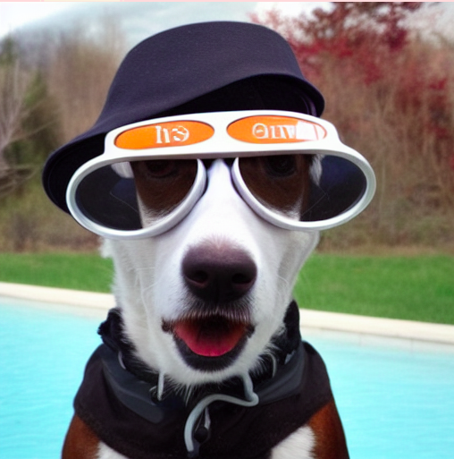
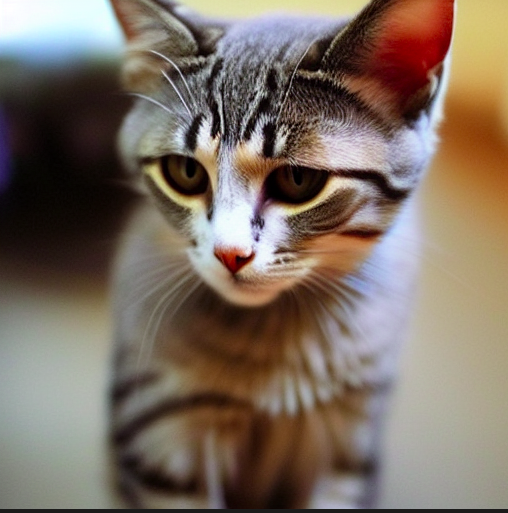

# Stable Diffusion Implementation

This repository contains an implementation of Stable Diffusion, a deep generative model for text-to-image synthesis. The implementation follows the architecture and techniques outlined in the original research paper:

> **Denoising Diffusion Probabilistic Models** ([Paper Link](https://arxiv.org/pdf/2006.11239.pdf))

Additionally, this implementation references concepts and methodologies from **Hugging Face's** open-source models and tools.

## Features
- **Text-to-Image Generation**: Generates high-quality images based on input text prompts.
- **DDPM Sampling**: Supports DDPM sampling strategy.
- **Latent Space Optimization**: Uses an encoder-decoder architecture for efficient image synthesis.

## Installation and Usage
To use this implementation, clone the repository and install the required dependencies:

```sh
git clone <repository-url>
cd <repository-folder>
pip install -r requirements.txt
```
- Refer demo.ipynb for example usage

## Sample Outputs

```prompt : A dog wearning a hat and goggles.```



```prompt : A pleading cat.```




## Model Components
- **VAE Encoder**: Encodes input images into a latent space representation.
- **VAE Decoder**: Decodes latent representations back into images.
- **DDPM Sampler**: Implements the denoising diffusion probabilistic model for image synthesis.
- **Text Encoder (CLIP)**: Converts text prompts into embeddings for guiding image generation.
- **UNet**: The core denoising model used in the diffusion process, responsible for gradually refining noisy images into coherent outputs.


## References
- [Hugging Face Stable Diffusion Implementation](https://github.com/huggingface/diffusers/)
- [Denoising Diffusion Probabilistic Models (DDPM)](https://arxiv.org/pdf/2006.11239.pdf)

## Acknowledgments
This project is inspired by the research and open-source work from Hugging Face and the academic community working on diffusion models.